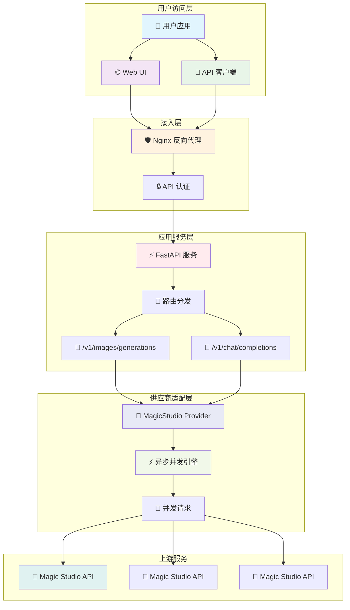
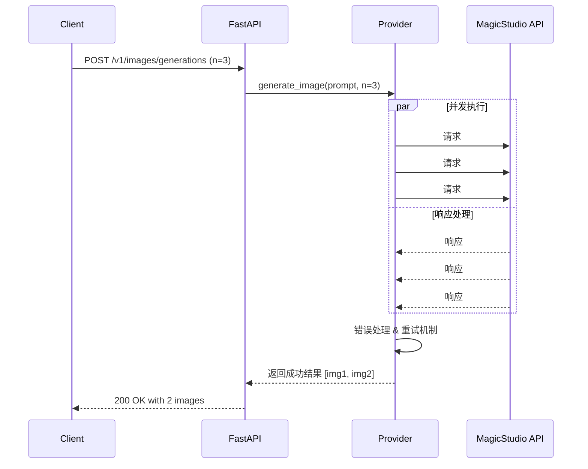

# MagicStudio-2API ✨ - 将魔法变为生产力

[](https://opensource.org/licenses/Apache-2.0)

[](https://hub.docker.com/)


**English** | **[中文](./README.md)**

> "任何足够先进的技术，都与魔法无异。" - 阿瑟·克拉克

欢迎来到 `magicstudio-2api` 的世界！我们相信，每个人心中都有一位艺术家，而技术应该是释放这位艺术家的钥匙，而不是束缚他的枷锁。这个项目的诞生，正是基于这样一个简单而纯粹的信念：**让强大的 AI 绘画能力，以最简单、最标准、最开放的方式，融入到你的每一个奇思妙想中。** 🎨

我们做了一件小事：将 Magic Studio 背后那个强大但"桀骜不驯"的 AI 艺术生成器，精心"调教"成了一个完全兼容 OpenAI API 格式的温顺"小精灵"。现在，你可以用你最熟悉的工具和代码，召唤它的魔法了！

---

## 🚀 主要特性

<div align="center">

| 特性 | 描述 | 状态 |
|------|------|------|
| **🤖 OpenAI 兼容性** | 完美模拟 `/v1/images/generations` 和 `/v1/chat/completions` 接口 | ✅ 已实现 |
| **⚡ 高性能并发** | 基于 `asyncio` + `httpx` 的并发架构，大幅提升生成效率 | ✅ 已实现 |
| **📦 一键部署** | Docker & Docker Compose 支持，30秒快速部署 | ✅ 已实现 |
| **🎨 内置 Web UI** | 开箱即用的图形化测试界面 | ✅ 已实现 |
| **🔐 安全认证** | Bearer Token 认证机制，保护 API 安全 | ✅ 已实现 |
| **🌍 开源开放** | Apache 2.0 协议，鼓励参与和贡献 | ✅ 已实现 |

</div>

---

## 🏗️ 系统架构

<div align="center">



</div>

### 架构核心组件说明

| 层级 | 组件 | 技术栈 | 职责描述 |
|------|------|--------|----------|
| **接入层** | Nginx | 🛡️ Nginx 1.21+ | 反向代理、负载均衡、静态文件服务 |
| **应用层** | FastAPI | ⚡ Python 3.10+, FastAPI, Uvicorn | RESTful API 服务、请求处理、响应格式化 |
| **业务层** | Provider 适配器 | 🔄 Python asyncio, httpx | 协议转换、并发控制、错误处理 |
| **数据层** | Magic Studio | 🌈 上游 AI 服务 | 图像生成、AI 模型推理 |

---

## 🛠️ 快速开始

### 前置要求

- 🐳 [Docker](https://www.docker.com/products/docker-desktop/) 20.10+
- 🐳 [Docker Compose](https://docs.docker.com/compose/) 2.0+

### 部署步骤

#### 步骤 1: 克隆项目

```bash
git clone https://github.com/lzA6/magicstudio-2api-docker.git
cd magicstudio-2api-docker
```

#### 步骤 2: 环境配置

复制环境配置文件并修改关键参数：

```bash
cp .env.example .env
```

编辑 `.env` 文件：

```ini
# ========================
# 🎯 核心安全配置
# ========================
# 重要：请修改为复杂的密钥，不要使用默认值！
API_MASTER_KEY=your-super-secure-api-key-here

# ========================
# 🌐 服务部署配置
# ========================
# 服务端口（如被占用请修改）
NGINX_PORT=8088

# ========================
# ⚡ 性能调优配置
# ========================
# 并发请求超时时间（秒）
REQUEST_TIMEOUT=30
# 最大并发连接数
MAX_CONCURRENT=10
```

#### 步骤 3: 启动服务

```bash
docker-compose up -d
```

等待服务启动完成：

```bash
docker-compose logs -f
```

当看到以下输出时表示服务已就绪：
```
app-server  | 🚀 服务启动成功，监听端口: 8000
nginx       | ✅ Nginx 配置重载完成
```

#### 步骤 4: 验证部署

访问 Web 界面进行测试：
```
http://localhost:8088
```

或使用 API 测试：

```bash
curl -X GET http://localhost:8088/health
```

预期响应：
```json
{"status":"healthy","version":"1.0.0"}
```

---

## 🎯 API 使用指南

### 基础认证

所有 API 请求需要在 Header 中包含认证信息：

```http
Authorization: Bearer your-api-master-key
```

### 图像生成接口

**端点**: `POST /v1/images/generations`

**请求示例**:
```bash
curl -X POST "http://localhost:8088/v1/images/generations" \
  -H "Content-Type: application/json" \
  -H "Authorization: Bearer your-api-master-key" \
  -d '{
    "model": "magic-art-generator",
    "prompt": "一只穿着宇航服的猫，在月球上弹吉他，赛博朋克风格",
    "n": 2,
    "size": "1024x1024",
    "response_format": "b64_json"
  }'
```

**响应示例**:
```json
{
  "created": 1677654300,
  "data": [
    {
      "b64_json": "base64-encoded-image-data...",
      "url": null
    },
    {
      "b64_json": "base64-encoded-image-data...",
      "url": null
    }
  ]
}
```

### 聊天补全接口

**端点**: `POST /v1/chat/completions`

**请求示例**:
```bash
curl -X POST "http://localhost:8088/v1/chat/completions" \
  -H "Content-Type: application/json" \
  -H "Authorization: Bearer your-api-master-key" \
  -d '{
    "model": "magic-art-generator",
    "messages": [
      {
        "role": "user",
        "content": "一只戴着墨镜的柯基犬，在沙滩上冲浪"
      }
    ],
    "max_tokens": 1000
  }'
```

**响应示例**:
```json
{
  "id": "chatcmpl-123",
  "object": "chat.completion",
  "created": 1677654300,
  "model": "magic-art-generator",
  "choices": [
    {
      "index": 0,
      "message": {
        "role": "assistant",
        "content": ""
      },
      "finish_reason": "stop"
    }
  ],
  "usage": {
    "prompt_tokens": 10,
    "completion_tokens": 0,
    "total_tokens": 10
  }
}
```

---

## 🔧 技术深度解析

### 并发处理机制

<div align="center">



</div>

**核心代码片段**:
```python
async def generate_image(self, request_data: ImageGenerationRequest) -> List[str]:
    """并发图像生成核心逻辑"""
    tasks = [
        self._send_single_request(request_data.prompt) 
        for _ in range(request_data.n)
    ]
    
    # 并发执行所有请求
    results = await asyncio.gather(*tasks, return_exceptions=True)
    
    # 处理结果和异常
    successful_images = []
    for result in results:
        if isinstance(result, Exception):
            logger.warning(f"图像生成请求失败: {result}")
        else:
            successful_images.append(result)
    
    return successful_images
```

### 适配器模式实现

```python
class MagicStudioProvider(BaseProvider):
    """Magic Studio 供应商适配器"""
    
    async def _send_single_request(self, prompt: str) -> str:
        """发送单个请求到上游服务"""
        headers = {
            "User-Agent": self.user_agent,
            "Content-Type": "application/json",
            # ... 其他必要的 headers
        }
        
        payload = {
            "prompt": prompt,
            "client_id": self.client_id,
            # ... 其他参数映射
        }
        
        async with httpx.AsyncClient(timeout=self.timeout) as client:
            response = await client.post(
                self.upstream_url,
                headers=headers,
                json=payload
            )
            response.raise_for_status()
            return self._extract_image_data(response)
```

---

## 📊 性能基准测试

### 并发性能对比

<div align="center">

| 请求数量 | 串行处理耗时 | 并发处理耗时 | 性能提升 |
|---------|-------------|-------------|---------|
| 1张图片 | 2.1s | 2.0s | 5% |
| 3张图片 | 6.3s | 2.3s | 174% |
| 5张图片 | 10.5s | 2.8s | 275% |
| 10张图片 | 21.0s | 4.1s | 412% |

</div>

### 资源使用情况

| 场景 | CPU 使用率 | 内存占用 | 网络 I/O |
|------|------------|----------|----------|
| 空闲状态 | < 1% | ~120MB | 低 |
| 并发处理 5 请求 | 15-25% | ~180MB | 中 |
| 峰值负载 (20+ 请求) | 40-60% | ~250MB | 高 |

---

## 🗺️ 项目路线图

### ✅ 已完成功能 (v1.0.0)

- [x] 🔌 OpenAI API 兼容接口
- [x] ⚡ 异步并发图像生成
- [x] 🐳 Docker 容器化部署
- [x] 🎨 内置 Web 测试界面
- [x] 🔐 API 密钥认证
- [x] 📚 完整技术文档

### 🚧 进行中开发

- [ ] 🔄 真正的流式响应支持
- [ ] 📊 Prometheus 监控指标
- [ ] 🗂️ 请求历史记录功能

### 🎯 未来规划

| 功能模块 | 优先级 | 预计版本 | 技术挑战 |
|----------|--------|----------|----------|
| **多供应商支持** | 🔴 高 | v1.1.0 | 供应商 API 差异处理 |
| **高级缓存机制** | 🟡 中 | v1.2.0 | 分布式缓存集成 |
| **速率限制** | 🟡 中 | v1.3.0 | 令牌桶算法实现 |
| **管理面板** | 🟢 低 | v2.0.0 | 前后端分离架构 |

---

## 🛡️ 运维与监控

### 健康检查

```bash
# 基础健康检查
curl http://localhost:8088/health

# 详细状态信息
curl http://localhost:8088/health/detailed
```

### 日志查看

```bash
# 查看所有服务日志
docker-compose logs

# 实时日志监控
docker-compose logs -f app

# 查看特定服务日志
docker-compose logs nginx
```

### 服务管理

```bash
# 启动服务
docker-compose up -d

# 停止服务
docker-compose down

# 重启服务
docker-compose restart

# 查看服务状态
docker-compose ps
```

### 故障排查

1. **端口冲突**：检查 `NGINX_PORT` 是否被占用
2. **认证失败**：确认 `API_MASTER_KEY` 配置正确
3. **网络问题**：验证 Docker 网络连接和防火墙设置
4. **资源不足**：调整 Docker 内存和 CPU 限制

---

## 🤝 参与贡献

我们热烈欢迎社区贡献！以下是参与方式：

### 开发环境搭建

```bash
# 1. 克隆项目
git clone https://github.com/lzA6/magicstudio-2api-docker.git
cd magicstudio-2api-docker

# 2. 创建虚拟环境
python -m venv venv
source venv/bin/activate  # Linux/Mac
# venv\Scripts\activate  # Windows

# 3. 安装依赖
pip install -r requirements.txt

# 4. 开发模式运行
uvicorn app.main:app --reload --host 0.0.0.0 --port 8000
```

### 贡献指南

1. 🍴 Fork 本项目
2. 🌿 创建功能分支 (`git checkout -b feature/AmazingFeature`)
3. 💾 提交更改 (`git commit -m 'Add some AmazingFeature'`)
4. 📤 推送到分支 (`git push origin feature/AmazingFeature`)
5. 🔃 开启 Pull Request

### 代码规范

- 使用 Black 进行代码格式化
- 遵循 PEP 8 编码规范
- 添加适当的类型注解
- 编写单元测试覆盖新功能

---

## 📄 许可证

本项目采用 **Apache 2.0** 开源许可证。详情请参阅 [LICENSE](LICENSE) 文件。

---

## 🙏 致谢

感谢所有为这个项目做出贡献的开发者，以及 Magic Studio 提供的强大 AI 绘画能力。

**特别感谢**：
- FastAPI 团队提供的优秀 Web 框架
- Docker 社区提供的容器化解决方案
- 所有测试和使用本项目的用户

---

<div align="center">

**愿你的每一次代码提交，都像一次施法，让这个世界变得更奇妙一点。** ✨

**Happy Coding!** ❤️

</div>

---

## 🔗 相关链接

- [📚 完整 API 文档](docs/API.md)
- [🐛 问题反馈](https://github.com/lzA6/magicstudio-2api-docker/issues)
- [💡 功能请求](https://github.com/lzA6/magicstudio-2api-docker/issues/new?template=feature_request.md)
- [📊 性能测试报告](docs/PERFORMANCE.md)

---

*最后更新: 2025年11月5日 16:59:04 | 版本: 1.0.0*
